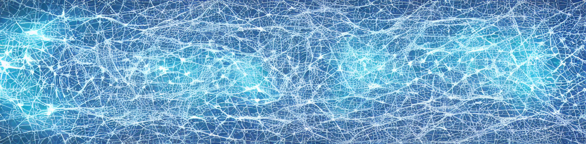
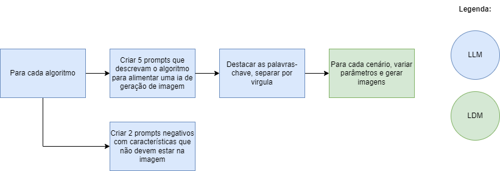

# OptiVision: Visualizing Optimization Algorithms

O objetivo deste repositório é responder uma pergunta: Se uma LLM descrever um cenário que represente o funcionamento de um algoritmo de otimização e uma LDM criar imagem deste cenário, como ele cenário seria?

Para responder esta questão eu segui os seguintes passos:

Inicialmente foram criados 5 prompts para cada um destes 8 algoritmos de otimização:
- Ant Colony Optimization
- Beam Search
- Genetic Algorithm
- Local Search
- Particle Swarm Optimization
- Quantum Annealing
- Simulated Annealin
- Tabu Search

Posteriormente foram criados 2 prompts negativos para cada um dos 8 algoritmos, estes prompts negativos removem aspectos negativos da imagem e permitem obter melhores resultados.

Com os prompts gerados, foi possível utilizar uma LDM (StableDiffusion v1.5) para gerar as imagens.

Durante a geração fixou-se o parâmetro inference steps em 100 e foram variados tanto o parâmetro guidance scale, quanto o prompt negativo para poder avaliar os efeitos nas imagens geradas.

Como podem ver a seguir, foi possível obter uma rica variedade de representações visuais, permitindo que cada imagem refletisse a essência de cada algoritmo de forma artística e conceitual.

# Algoritmos e prompts:
A seguir serão descritos os algoritmos, prompts e parâmetros utilizados.

**Quantum Annealing**
- Descrição: Um algoritmo que utiliza efeitos quânticos para encontrar o mínimo global de uma função. A imagem pode representar transições entre diferentes estados, sugerindo a ideia de tunelamento quântico através de barreiras.

- Prompt: "Quantum Annealing 2": "Quantum waves, particle explores all paths, converging on optimal solution, highly detailed, 8k, 4k, post processing."
- Parâmetros: Guidance Scale: 7.5
    

- Prompt: "Quantum Annealing 3": "Quantum particles tunneling through energy barriers, finding global minimum, highly detailed, 8k, 4k, post processing."
- Parâmetros: Guidance Scale: 8.5

**Simulated Annealing (SA)**
- Descrição: Baseado no processo de resfriamento lento de metais, o SA tenta evitar mínimos locais. A imagem simboliza a cristalização gradual, com formas que lentamente se ajustam para encontrar uma configuração otimizada.

- Prompt: "Lava cooling into solid rock, symbolizing search for optimal solution, highly detailed, post processing, highly detailed, 8k, 4k, post processing."
- Parâmetros: Guidance Scale: 18.0

- Prompt: Igual ao anterior.
- Parâmetros: Guidance Scale: 8.5

**Local Search**
- Descrição: Um método de otimização que busca soluções locais. A imagem reflete uma paisagem montanhosa onde o algoritmo explora picos e vales, representando a busca por ótimos locais.

- Prompt: "Traveler in rugged landscape, limited to nearby peaks, symbolizing local search, highly detailed, 8k, 4k, post processing."
- Parâmetros: Guidance Scale: 12.0

- Prompt: "Person searching for highest point, stuck on lower hills, symbolizing local search, highly detailed, 8k, 4k, post processing."
- Parâmetros: Guidance Scale: 18.0

**Genetic Algorithm (GA)**
- Descrição: Inspirado na evolução biológica, o GA utiliza mecanismos de seleção natural e recombinação genética. A imagem destaca a ideia de mutações e cruzamentos, simbolizados por formas entrelaçadas e evoluções progressivas.

- Prompt: "Evolving organisms competing and mutating, finding best solution, highly detailed, 8k, 4k, post processing."
- Parâmetros: Guidance Scale: 18.0

- Prompt: Igual ao anterior.
- Parâmetros: Guidance Scale: 12.0

**Particle Swarm Optimization (PSO)**
Descrição: Inspirado no movimento de enxames, o PSO mostra partículas se movendo em um espaço de solução. A imagem apresenta movimentos fluidos e coordenados que simbolizam o comportamento colaborativo do enxame.

- Prompt: "Particle Swarm Optimization 1": "Particles moving like a flock of birds, converging on best solution, highly detailed, 8k, 4k, post processing."
- Parâmetros: Guidance Scale: 12.0

- Prompt: "Particles moving in harmony, inspired by nature, seeking best outcome, highly detailed, 8k, 4k, post processing."
- Parâmetros: Guidance Scale: 7.5

**Ant Colony Optimization**
- Descrição: A ACO é inspirada no comportamento de formigas em busca de alimento, utilizando a construção de trilhas de feromônio. Na imagem, vemos trilhas que se entrelaçam em um ambiente complexo, refletindo o comportamento emergente das colônias de formigas.

- Prompt: "Ants exploring network, converging on shortest path via pheromones, highly detailed, 8k, 4k, post processing."
- Parâmetros: Guidance Scale: 12

- Prompt: "Ants finding best path in maze, using pheromone trails as communication, highly detailed, 8k, 4k, post processing."
- Parâmetros: Guidance Scale: 8.5

**Beam Search**
- Descrição: Um algoritmo de busca heurística que expande nós mais promissores. A imagem reflete a ideia de feixes de luz (ou caminhos) que focam apenas nas melhores opções, explorando um caminho otimizado entre várias alternativas.
- Prompt: "Beams of light scanning forest, focusing on most promising paths, highly detailed, 8k, 4k, post processing."
- Parâmetros: Guidance Scale: 18.0

- Prompt: Igual ao anterior.
- Parâmetros: Guidance Scale: 18.0

**Tabu Search**
- Descrição: Utiliza uma lista tabu para evitar ciclos e melhorar a busca. A imagem pode ter traços que demonstram movimentos restritos, evitando áreas já exploradas, simbolizando a memória do algoritmo.

- Prompt: "Creature exploring maze, avoiding previously explored paths, symbolizing Tabu Search, highly detailed, 8k, 4k, post processing."
- Parâmetros: Guidance Scale: 7.5

- Prompt: "Intelligent creature avoids dead ends in maze, exploring new promising paths, highly detailed, 8k, 4k, post processing."
- Parâmetros: Guidance Scale: 12.0

## Pacotes Requeridos
- torch
- diffusers 
- matplotlib
- numpy

## Outros projetos de otimização:
Também mantenho outros repositórios onde você encontrará outros projeto onde abordo assuntos relacionados a otimização matemática e pesquisa operacional.

- [Simulated Annealing aplicado no Processamento de Imagens](https://github.com/rafaelgard/Simulated-annealing)
- [Projetos de Otimizacao com Gurobi Highs e Pyomo](https://github.com/rafaelgard/Projetos_de_Otimizacao_com_Gurobi_Highs_e_Pyomo)
