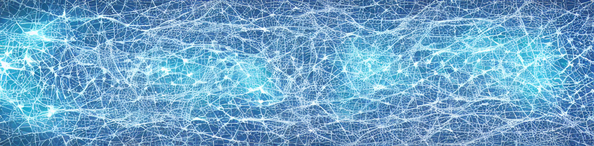
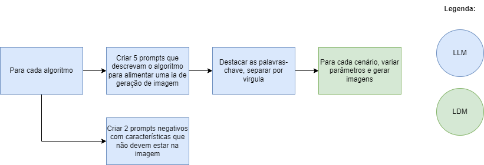

# OptiVision: Visualizing Optimization Algorithms

O objetivo deste repositório é responder uma pergunta: Se uma LLM descrever um cenário que represente o funcionamento de um algoritmo de otimização e uma LDM criar imagens deste cenário, como este cenário seria?

--> [Click Here to read the english Version](README_ENGLISH.md)

Para responder esta questão eu segui os seguintes passos:

Inicialmente foram criados 5 prompts para cada um destes 8 algoritmos de otimização:
- Ant Colony Optimization
- Beam Search
- Genetic Algorithm
- Local Search
- Particle Swarm Optimization
- Quantum Annealing
- Simulated Annealing
- Tabu Search

Posteriormente foram criados 2 prompts negativos para cada um dos 8 algoritmos, estes prompts negativos removem aspectos negativos da imagem e permitem obter melhores resultados.

Com os prompts gerados, foi possível utilizar uma LDM (stable-diffusion-3.5-large) para gerar as imagens.

Durante a geração fixou-se o parâmetro inference steps em 100 e foram variados tanto o parâmetro guidance scale, quanto o prompt negativo para poder avaliar os efeitos nas imagens geradas.

Como pode ver a seguir, foi possível obter uma rica variedade de representações visuais, permitindo que cada imagem refletisse a essência de cada algoritmo de forma artística e conceitual.

# Algoritmos e prompts:
A seguir serão descritos os algoritmos, prompts e parâmetros utilizados.

**Local Search**
- Descrição: Um método de otimização que busca soluções locais. A imagem reflete uma paisagem montanhosa onde o algoritmo explora picos e vales, representando a busca por ótimos locais.

- Prompt: "Traveler in rugged landscape, limited to nearby peaks, symbolizing local search, highly detailed, 8k, 4k, post processing."
- Parâmetros: Guidance Scale: 12.0

- Prompt: "Person searching for highest point, stuck on lower hills, symbolizing local search, highly detailed, 8k, 4k, post processing."
- Parâmetros: Guidance Scale: 12.0

**Genetic Algorithm (GA)**
- Descrição: Inspirado na evolução biológica, o GA utiliza mecanismos de seleção natural e recombinação genética. A imagem destaca a ideia de mutações e cruzamentos, simbolizados por formas entrelaçadas e evoluções progressivas.

- Prompt: "Evolving organisms competing and mutating, finding best solution, highly detailed, 8k, 4k, post processing."
- Parâmetros: Guidance Scale: 12.0

**Simulated Annealing (SA)**
- Descrição: Baseado no processo de resfriamento lento de metais, o SA tenta evitar mínimos locais. A imagem simboliza a cristalização gradual, com formas que lentamente se ajustam para encontrar uma configuração otimizada.

- Prompt: "Lava cooling into solid rock, symbolizing search for optimal solution, highly detailed, post processing, highly detailed, 8k, 4k, post processing."
- Parâmetros: Guidance Scale: 8.5

**Quantum Annealing**
- Descrição: Um algoritmo que utiliza efeitos quânticos para encontrar o mínimo global de uma função. A imagem pode representar transições entre diferentes estados, sugerindo a ideia de tunelamento quântico através de barreiras.

- Prompt: "Quantum waves, particle explores all paths, converging on optimal solution, highly detailed, 8k, 4k, post processing."
- Parâmetros: Guidance Scale: 8.5
    

- Prompt: "Quantum particles tunneling through energy barriers, finding global minimum, highly detailed, 8k, 4k, post processing."
- Parâmetros: Guidance Scale: 8.5

**Particle Swarm Optimization (PSO)**
Descrição: Inspirado no movimento de enxames, o PSO mostra partículas se movendo em um espaço de solução. A imagem apresenta movimentos fluidos e coordenados que simbolizam o comportamento colaborativo do enxame.

- Prompt: "Particles moving like a flock of birds, converging on best solution, highly detailed, 8k, 4k, post processing."
- Parâmetros: Guidance Scale: 12.0

- Prompt: "Particles moving in harmony, inspired by nature, seeking best outcome, highly detailed, 8k, 4k, post processing."
- Parâmetros: Guidance Scale: 7.5

**Ant Colony Optimization**
- Descrição: A ACO é inspirada no comportamento de formigas em busca de alimento, utilizando a construção de trilhas de feromônio. Na imagem, vemos trilhas que se entrelaçam em um ambiente complexo, refletindo o comportamento emergente das colônias de formigas.

- Prompt: "Ants finding best path in maze, using pheromone trails as communication, highly detailed, 8k, 4k, post processing."
- Parâmetros: Guidance Scale: 12.0

**Beam Search**
- Descrição: Um algoritmo de busca heurística que expande nós mais promissores. A imagem reflete a ideia de feixes de luz (ou caminhos) que focam apenas nas melhores opções, explorando um caminho otimizado entre várias alternativas.
- Prompt: "Beams of light scanning forest, focusing on most promising paths, highly detailed, 8k, 4k, post processing."
- Parâmetros: Guidance Scale: 18.0

**Tabu Search**
- Descrição: Utiliza uma lista tabu para evitar ciclos e melhorar a busca. A imagem pode ter traços que demonstram movimentos restritos, evitando áreas já exploradas, simbolizando a memória do algoritmo.

- Prompt: "Creature exploring maze, avoiding previously explored paths, symbolizing Tabu Search, highly detailed, 8k, 4k, post processing."
- Parâmetros: Guidance Scale: 7.5

## Comparação de Imagens: Stable Diffusion 1.5 vs 3.5 Large:
Com a evolução dos modelos de difusão, a qualidade das imagens geradas tem melhorado significativamente. Esta comparação apresenta lado a lado as imagens geradas pelo Stable Diffusion 1.5 e pelo Stable Diffusion 3.5 Large, destacando as diferenças em termos de detalhes, iluminação, texturas e realismo.

O Stable Diffusion 1.5 foi lançado em outubro de 2022, enquanto o Stable Diffusion 3.5 Large foi disponibilizado em 22 de outubro de 2024. Isso representa uma diferença de aproximadamente 24 meses entre os lançamentos. 

Essa evolução de dois anos reflete avanços significativos na tecnologia de geração de imagens por inteligência artificial, resultando em melhorias notáveis na qualidade e precisão das imagens produzidas.

| Algoritmo | Stable Diffusion 1.5 | Stable Diffusion 3.5 Large |
|-----------|----------------------|----------------------|
| Local Search |  |  |
| Genetic Algorithm (GA) |  |  |
| Simulated Annealing (SA) |  |  |
| Quantum Annealing |  |  |
| Particle Swarm Optimization (PSO) |  |  |
| Ant Colony Optimization |  |  |
| Beam Search |  |  |
| Tabu Search |  |  |

## Pacotes Requeridos
- torch
- torchvision
- accelerate
- diffusers 
- matplotlib
- numpy

## Outros projetos de otimização:
Também mantenho outros repositórios onde você encontrará outros projeto onde abordo assuntos relacionados a otimização matemática e pesquisa operacional.

- [Simulated Annealing aplicado no Processamento de Imagens](https://github.com/rafaelgard/Simulated-annealing)
- [Projetos de Otimizacao com Gurobi Highs e Pyomo](https://github.com/rafaelgard/Projetos_de_Otimizacao_com_Gurobi_Highs_e_Pyomo)
