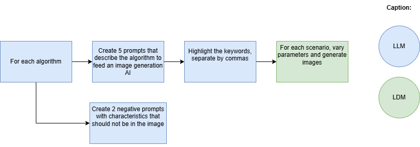

# OptiVision: Visualizing Optimization Algorithms

The goal of this repository is to answer a question: If an LLM describes a scenario that represents the operation of an optimization algorithm and an LDM creates images of this scenario, what would this scenario look like?

To answer this question, I followed these steps:

Initially, 5 prompts were created for each of these 8 optimization algorithms:
- Ant Colony Optimization
- Beam Search
- Genetic Algorithm
- Local Search
- Particle Swarm Optimization
- Quantum Annealing
- Simulated Annealing
- Tabu Search

Subsequently, 2 negative prompts were created for each of the 8 algorithms. These negative prompts remove unwanted aspects of the image and allow for better results.

With the generated prompts, it was possible to use an LDM (stable-diffusion-3.5-large) to generate the images.

During generation, the inference steps parameter was fixed at 100, and both the guidance scale parameter and the negative prompt were varied to evaluate their effects on the generated images.

As you can see below, it was possible to obtain a rich variety of visual representations, allowing each image to artistically and conceptually reflect the essence of each algorithm.

# Algorithms and Prompts:
Below, the algorithms, prompts, and parameters used are described.

**Local Search**
- Description: An optimization method that searches for local solutions. The image reflects a mountainous landscape where the algorithm explores peaks and valleys, representing the search for local optima.

- Prompt: "Traveler in rugged landscape, limited to nearby peaks, symbolizing local search, highly detailed, 8k, 4k, post-processing."
- Parameters: Guidance Scale: 12.0

**Genetic Algorithm (GA)**
- Description: Inspired by biological evolution, GA uses mechanisms of natural selection and genetic recombination. The image highlights the idea of mutations and crossovers, symbolized by intertwined forms and progressive evolutions.

- Prompt: "Evolving organisms competing and mutating, finding best solution, highly detailed, 8k, 4k, post-processing."
- Parameters: Guidance Scale: 12.0

**Simulated Annealing (SA)**
- Description: Based on the slow cooling process of metals, SA tries to avoid local minima. The image symbolizes gradual crystallization, with shapes slowly adjusting to find an optimized configuration.

- Prompt: "Lava cooling into solid rock, symbolizing search for optimal solution, highly detailed, post-processing, highly detailed, 8k, 4k, post-processing."
- Parameters: Guidance Scale: 8.5

**Quantum Annealing**
- Description: An algorithm that uses quantum effects to find the global minimum of a function. The image may represent transitions between different states, suggesting the idea of quantum tunneling through barriers.

- Prompt: "Quantum waves, particle explores all paths, converging on optimal solution, highly detailed, 8k, 4k, post-processing."
- Parameters: Guidance Scale: 8.5
    

**Particle Swarm Optimization (PSO)**
- Description: Inspired by swarm movement, PSO shows particles moving in a solution space. The image presents fluid and coordinated movements symbolizing the swarm's collaborative behavior.

- Prompt: "Particles moving like a flock of birds, converging on best solution, highly detailed, 8k, 4k, post-processing."
- Parameters: Guidance Scale: 12.0

**Ant Colony Optimization**
- Description: ACO is inspired by the behavior of ants searching for food, using pheromone trail construction. The image shows intertwining trails in a complex environment, reflecting the emergent behavior of ant colonies.

- Prompt: "Ants finding best path in maze, using pheromone trails as communication, highly detailed, 8k, 4k, post-processing."
- Parameters: Guidance Scale: 12.0

## Image Comparison: Stable Diffusion 1.5 vs 3.5 Large:
With the evolution of diffusion models, the quality of generated images has significantly improved. This comparison presents side-by-side images generated by Stable Diffusion 1.5 and Stable Diffusion 3.5 Large, highlighting the differences in details, lighting, textures, and realism.

Stable Diffusion 1.5 was released in October 2022, while Stable Diffusion 3.5 Large was made available on October 22, 2024. This represents a difference of approximately 24 months between releases.

This two-year evolution reflects significant advancements in AI-generated image technology, resulting in noticeable improvements in image quality and accuracy.

| Algorithm | Stable Diffusion 1.5 | Stable Diffusion 3.5 Large |
|-----------|----------------------|----------------------|
| Local Search |  |  |
| Genetic Algorithm (GA) |  |  |
| Simulated Annealing (SA) |  |  |

## Required Packages
- torch
- torchvision
- accelerate
- diffusers 
- matplotlib
- numpy

## Other Optimization Projects:
I also maintain other repositories where you can find projects related to mathematical optimization and operations research.

- [Simulated Annealing Applied to Image Processing](https://github.com/rafaelgard/Simulated-annealing)
- [Optimization Projects with Gurobi Highs and Pyomo](https://github.com/rafaelgard/Projetos_de_Otimizacao_com_Gurobi_Highs_e_Pyomo)
